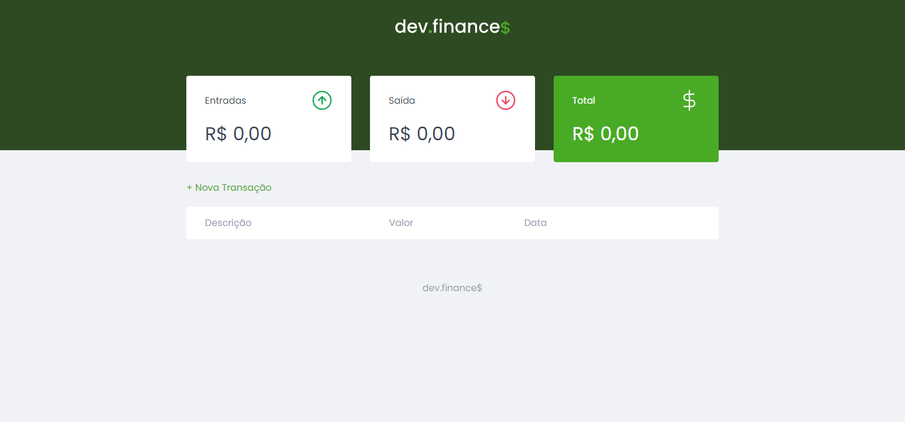

# dev.finance$

## Conteúdo
- [Sobre](#sobre)
- [Link](#link)
- [Tecnologias](#tecnologias)
- [Autor](#autor)

## Sobre
Projeto criado durante a Maratona Discover 01. O dev.finances é uma aplicação de gestão financeira, onde é possível adicionar e excluir transações e ver o saldo de entrada e saída.

## Link
- Site - https://dev-finances-sanches.netlify.app

## Tecnologias
- HTML
- CSS
- JavaScript

## Autor
- Site - https://sanches-spoladore.netlify.app